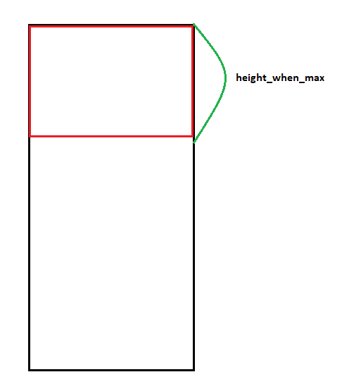
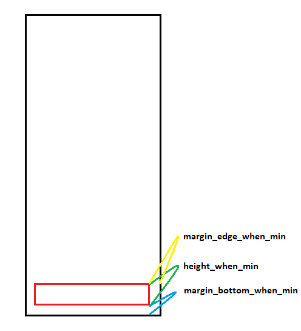
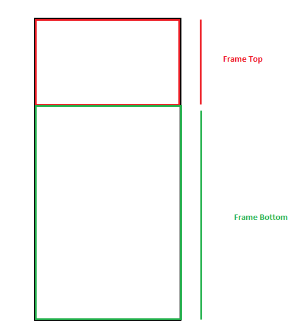

# DragView


#### Download

```java

	allprojects {
		repositories {
			...
			maven { url 'https://jitpack.io' }
		}
	}
    
    
    	dependencies {
	        implementation 'com.github.tuanhav95:DragView:1.1.0'
	}
```

#### Using [Detail code java](https://github.com/tuanhav95/DragView/blob/master/example/src/main/java/com/tuanhav95/example/NormalActivity.kt)

* Xml

```java
   <com.tuanhav95.drag.DragView
        android:id="@+id/dragView"
        android:layout_width="match_parent"
        android:layout_height="match_parent"
        app:height_when_max="300dp"
        app:height_when_min="80dp"
        app:margin_bottom_when_min="8dp"
        app:margin_edge_when_min="8dp"
        app:percent_when_middle="0.9"
        app:state="MIN" />
```

 | 
--- | --- 

* Listener

```java
        dragView.setDragListener(object : DragView.DragListener {
            override fun onChangeState(state: DragView.State) {
            }

            override fun onChangePercent(percent: Float) {
                alpha.alpha = 1 - percent
            }

        })
```

* Add frame

```java
        supportFragmentManager.beginTransaction().add(R.id.frameFirst, TopFragment()).commit() // add frame top
        supportFragmentManager.beginTransaction().add(R.id.frameSecond, BottomFragment()).commit() // add frame bottom
```



* Action

```java
        btnMax.setOnClickListener { dragView.maximize() }
        btnMin.setOnClickListener { dragView.minimize() }
        btnClose.setOnClickListener { dragView.close() }
```


#### Custom [Detail code java](https://github.com/tuanhav95/DragView/blob/master/example/src/main/java/com/tuanhav95/example/CustomActivity.kt)

* Custom
```java
        class DragSource @JvmOverloads constructor(
        	context: Context, attrs: AttributeSet? = null, defStyleAttr: Int = 0
	) : DragView(context, attrs, defStyleAttr) {

	    var mWidthWhenMax = 0

	    var mWidthWhenMiddle = 0

	    var mWidthWhenMin = 0

	    init {
		getFrameFirst().addView(inflate(R.layout.layout_top))
		getFrameSecond().addView(inflate(R.layout.layout_bottom))
	    }

	    override fun initFrame() {
		mWidthWhenMax = width

		mWidthWhenMiddle = (width - mPercentWhenMiddle * mMarginEdgeWhenMin).toInt()

		mWidthWhenMin = mHeightWhenMin * 22 / 9

		super.initFrame()
	    }

	    override fun refreshFrameFirst() {
		super.refreshFrameFirst()

		val width = if (mCurrentPercent < mPercentWhenMiddle) {
		    (mWidthWhenMax - (mWidthWhenMax - mWidthWhenMiddle) * mCurrentPercent)
		} else {
		    (mWidthWhenMiddle - (mWidthWhenMiddle - mWidthWhenMin) * (mCurrentPercent - mPercentWhenMiddle) / (1 - mPercentWhenMiddle))
		}

		frameTop.reWidth(width.toInt())
	    }
	}
```

* Xml
```java
   <com.tuanhav95.example.custom.DragSource
        android:id="@+id/dragView"
        android:layout_width="match_parent"
        android:layout_height="match_parent"
        app:height_when_max="300dp"
        app:height_when_min="58dp"
        app:state="MIN" />
```

* Code

```java
        dragView.setDragListener(object : DragView.DragListener {
            override fun onChangeState(state: DragView.State) {
            }

            override fun onChangePercent(percent: Float) {
                alpha.alpha = 1 - percent
                shadow.alpha = percent
            }

        })

        supportFragmentManager.beginTransaction().add(R.id.frameTop, TopFragment()).commit()
        supportFragmentManager.beginTransaction().add(R.id.frameBottom, BottomFragment()).commit()

        btnMax.setOnClickListener { dragView.maximize() }
        btnMin.setOnClickListener { dragView.minimize() }
        btnClose.setOnClickListener { dragView.close() }
```

